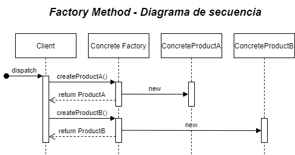

# Factory Method

## Cuando utilizarlo

* Cuando la creación directa de un objeto por medio del operador new pueda ser perjudicial.
* Cuando no se conoce en tiempo de diseño la subclase que se utilizará.
* Cuando es necesario controlar la creación de objetos por medio de una interface común.
* Cuando construimos un objeto basado en una serie de condiciones else if o switch.

## Componentes de Factory Method:

* IProduct: Representa de forma abstracta el objeto que queremos crear, mediante esta interface se definen la estructura que tendrá el objeto creado.
* ConcreteProduct: Representa una implementación concreta de la interface *IProduct*, la cual es creada a través del *ConcreteFactory*.
* AbastractFactory: Este componente puede ser opcional, sin embargo, se recomienda la creación de un *AbstractFactory* que define el comportamiento por default de los *ConcreteFactory*.
* ConcreteFactory: Representa una fábrica concreta la cual es utilizada para la creación de los *ConcreteProduct*, esta clase hereda el comportamiento básico del *AbstractFactory*.

<table>
  <tr>
    <td style="text-align:center; font-weight:bold; font-size:20px">Estructura de Clases</td>
     <td style="text-align:center; font-weight:bold; font-size:20px">Diagrama de Secuencia</td>
  </tr>
  <tr style="text-align:center;">
    <td></td>
    <td></td>
  </tr>
 </table>


## Interpretación Diagrama de secuencia:

1. El cliente le solicita al *ConcreteFactory* la creación del *ProductA*.
2. El *ConcreteFactory* localiza la implementación concreta de *ProductA* y crea una nueva instancia.
3. El *ConcreteFactory* regresa el *ConcreteProductA* creado.
4. El cliente le solicita al *ConcreteFactory* la creación del *ProductB*.
5. El *ConcreteFactory* localiza la implementación concreta de *ProductB* y crea una nueva instancia.
6. El *ConcreteFactory* regresa el *ConcreteProductB* creado.

## Escenario

Deseamos tener la opción de conectarnos a dos bases de datos distintas (Oracle y SQL Server). Esto podría darse por la necesidad de darle a los usuarios de nuestra aplicación la posibilidad de tener una base de datos Oracle u otra más robusta como SQL Server. Para esto desarrollaremos una clase de acceso a datos (DAO) de productos que nos permite guardar productos y consultarlos. El principal objetivo es que el cliente pueda utilizar el mismo DAO sin necesidad de cambiar de clase dependiendo la base de datos a utilizar.

## Solución

<div style="text-align: center">

</div>

* **DBFactory.properties**: Archivo de propiedades para determinar la clase a fábrica.

  ```properties
  #defaultDBClass OracleDBAdapter
  defaultDBClass SQLServerDBAdapter
  ```

* **DBOracle.properties**: Archivo de propiedades donde definimos los datos de conexión para conectarnos a la base de datos de Oracle.

* **DBSQLServer.properties**: Archivo de propiedades donde definimos los datos de conexión para conectarnos a la base de datos de SQL Server.

* **Interface IDBAdapter**: Define la estructura de los productos que podrá crear el Factory. En este caso habrá dos clases concretas, una para SQL Server y otra para Oracle.

  ```c#
  public interface IDBAdapter {
      public Connection getConnection();
  }
  ```

* **Clase OracleDBAdapter**: Clase que implementa la interface *IDBAdapter* y el método getConnection para regresar una conexión abierta a la base de datos Oracle.

	```c#
	public class OracleDBAdapter implements IDBAdapter {
    	public Connection getConnection() {
    		// Implementation
    	}
	}
	```

* **Clase SQLServerDBAdapter**: Clase que implementa la interface *IDBAdapter* y el método getConnection para regresar una conexión abierta a la base de datos SQL Server.

	```c#
	public class SQLServerDBAdapter implements IDBAdapter {
    	public Connection getConnection() {
    		// Implementation
    	}
	}
	```

* **Clase DBFactory**: Representa el *ConcreteFactory* y es utilizada para fabricar los adaptadores de conexión o los subtipos de *IDBAdapter* como *OracleDBAdapter* y *SQLServerDBAdapter*. La clase define los siguientes métodos

  * **getDBAdapter**: Nos permite solicitarle explícitamente qué tipo de conexión deseamos por medio del parámetro dbType, que esta´definido como una enumeración, la cual nos permite elegir entre Oracle y SQL Server. Este método nos puede servir cuando sabemos de antemano qué conexión deseamos elegir o tenemos la configuración del tipo de base de datos en una configuración externa.

  * **getDefaultDBAdapter**: Nos permite obtener una instancia de *IDBAdapter* previamente configurada en un archivo de configuración. Este método es útil cuando podemos pre-configurar qué tipo de conexión estaremos utilizando durante toda la ejecución del programa. Esta configuración está cargada en DBFactory.properties.

* **Enumeración DBType**: Enumeración utilizada para definir los tipos de base de datos soportadas.

  ```c#
  public enum DBType {
      SQLServer, Oracle
  }
  ```

* **Clase Product**: Clase utilizada para representar los registros de la base de datos como Objetos.

* **Clase ProductDAO**: El constructor manda llamar a nuestra factory *DBFactory* con el fin de obtener el *IDBAdapter*. Esta configuración le da la ventaja al *ProductDAO* de trabajar siempre de la misma manera sin importar qué base de datos esté utilizando. La clase define los siguientes métodos:

  * **findAllProducts**: Utilizado para consultar todos los productos de la base de datos.
  * **saveProduct**: Utilizado para guardar un nuevo producto.

* **PropertiesUtil**: Clase utilizada como clase de utilidad que define únicamente el método loadProperty, el cuál lee un archivo de propiedades determinado y lo carga en un objeto de tipo Properties. La URL del archivo a cargar es pasada como parámetro.

* **Clase FactoryMain**: Nos permite ejecutar la aplicación.
