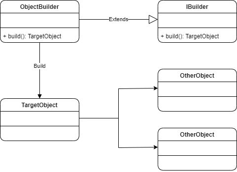
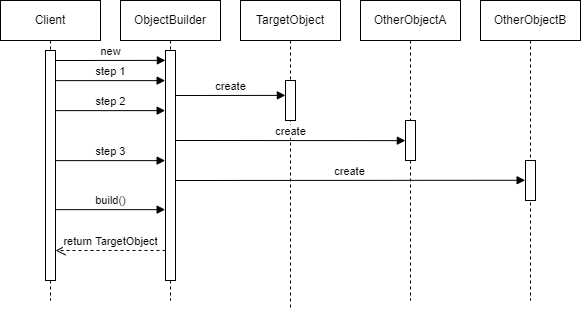
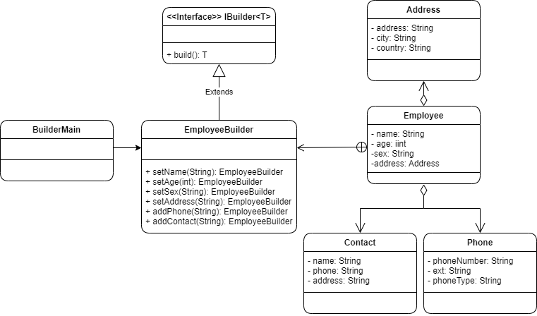

# Builder

## Cuando utilizarlo

* Cuando necesitamos un mecanismo simple para crear objetos complejos.
* Cuando necesitamos crear repetidamente objetos complejos.
* Cuando necesitamos ocultar a los usuarios la complejidad de la creación de un objeto determinado.

## Componentes de Builder

* IBuilder: No es obligatorio en todos los casos, sin embargo es una buena práctica especificar una interface comúin que tendrán todos los *Builder* que definiremos en nuestra aplicación. Puede ser una interface que defina únicamente el método build.
* ObjectBuilder: Clase que utilizaremos para crear los objetos *TarjectObject*. Esta clase debe heredar de IBuilder e implementar el método build, el cuál será utilizado para crear el *TarjectObject*. Como regla general, todos los métodos de esta clase retornan una instancia de sí mismo, con la finalidad de agilizar la creación. Esta clase por lo general es creada como una clase interna del *TarjectObject*.
* TarjetObject: Representa el objeto que deseamos crear con ayuda del *ObjectBuilder*,. Esta puede ser una clase simple o puede ser una clase muy compleja que tenga dentro más objetos.
* OtherObjects: Representa los posibles objetos que deberán ser creados cuando el *TarjectObject* sea construido por el *ObjectBuilder*.

<table>
  <tr>
    <td style="text-align:center; font-weight:bold; font-size:20px">Estructura de Clases</td>
     <td style="text-align:center; font-weight:bold; font-size:20px">Diagrama de Secuencia</td>
  </tr>
  <tr style="text-align:center;">
    <td></td>
    <td></td>
  </tr>
 </table>


## Interpretación Diagrama de secuencia

1. El cliente crea una instancia del *ObjectBuilder*.
2. El cliente ejecuta el paso 1 de la creación en el *ObjectBuilder*.
   1. Internamente el *ObjectBuilder* crea al *TargetObject*.
3. El cliente ejecuta el paso 2 de la creación en el *ObjectBuilder*.
   1. Internamente el *ObjectBuilder* crea un *OtherObjectA*.
4. El cliente ejecuta el paso 3 de la creación en el *ObjectBuilder*.
   1. Internamente el *ObjectBuilder* crea el *OtherObjectB*.
5. El cliente solicita al *ObjectBuilder* la creación del *TargetObject*. Este toma todos los objetos creados anteriormente y los asocia al *TargetObject* y lo devuelve.

## Escenario

Necesitamos crear la estructura completa de un empleado, el cual puede tener una dirección, uno o varios teléfonos y varios contactos, además de los datos básicos como su nombre, edad y sexo. El patrón Builder nos permite crear un Empleado de forma rápida y limpia, sin tener la necesidad de crear todos los objetos que lo componen, y nos evita conocer exactamente la lógica de creación.

## Solución



* **Interface IBuilder**: Interface en común entre todos los Builder que creemos en la aplicación. Esta interface es opcional y no es necesario crearla, sin embargo la creamos pensando en que podríamos tener más clases Builder para crear otros objetos.

  ```c#
  public interface IBuilder<T> {
      public T build();
  }
  ```

* **Clase Employee**: Clase utilizada para representar nuestro objeto principal.

* **Clase EmployeeBuilder**: Tiene un conjunto de métodos que nos permite establecer las propiedades del empleado y sus relaciones con otros objetos.

  ```c#
  public static class EmployeeBuilder implements IBuilder<Employee> {
      private String name;
      ...
      
      public EmployeeBuilder setName(String name) {
          this.name = name;
          return this;
      }
      ...
  }
  ```

  

* **Clase Phone**: Clase utilizada para representar nuestro objeto phone.

* **Clase Address**: Clase utilizada para representar nuestro objeto address.

* **Clase Contact**: Clase utilizada para representar nuestro objeto contact.

* **Clase BuilderMain**: Nos permite ejecutar la aplicación.

```c#
public static void Main() {
    var employee = new Employee.EmployeeBuilder()
        .setName(...)
        .setSex(...)
        .setAge(...)
        .setAddress(...)
        .addContacts(...)
        .addContacts(...)
        .addPhone(...)
        .addPhone(...)
        .build();
   	Console.Write(employee);
}
```

