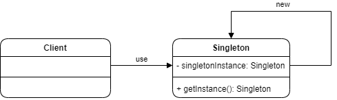
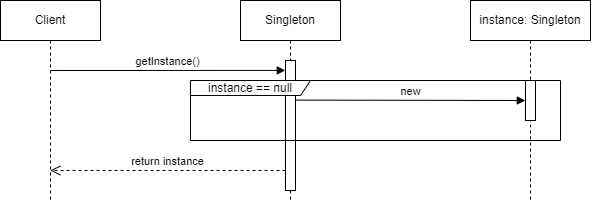
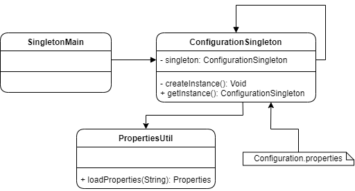

# Singleton

## Cuando utilizarlo

* Cuando la creación de objetos por medio del operador new es perjudicial.
* Cuando es obligatorio tener una única instancia en toda la aplicación y se necesita un acceso global a la misma.

## Componentes de Singleton:

* Client: Componente que desea obtener una instancia de la clase *Singleton*
* Singleton: Clase que implementa el patrón Singleton, de la cual únicamente se podrá tener una instancia durante toda la vida de la aplicación.

<table>
  <tr>
    <td style="text-align:center; font-weight:bold; font-size:20px">Estructura de Clases</td>
     <td style="text-align:center; font-weight:bold; font-size:20px">Diagrama de Secuencia</td>
  </tr>
  <tr style="text-align:center;">
    <td></td>
    <td></td>
  </tr>
 </table>

## Interpretación Diagrama de secuencia:

1. El cliente solicita la instancia al *Singleton* mediante el método estático *getInstance*.
2. El *Singleton* validará si la instancia ya fue creada anteriormente, de no haber sido creada entonces se crea una nueva.
3. Se devuelve la instancia creada en el paso anterior o se regresa la instancia exixtente.

## Escenario

Se ha pedido crear una aplicación que cargue la configuración guardada en un archivo de propiedades. Esta configuración deberá estar disponible en toda la aplicación, incluyendo los módulos que va a tener. Dicha configuración tiene una necesidad especial y es que deberá existir un solo objeto de configuración en toda la aplicación, en la cula todos los módulos pueden interactual de tal manera que si un módulo afecta a alguna propiedad de la configuración, el resto del módulo lo pueda ver reflejado.

## Solución



* **ConfigurationSingleton**: Representa al Singleton y podemos ver que tiene una referencia a sí misma mediante una variable estática en ella. Esta clase tiene las siguientes variables:

  * **CONFIGURATION_PROP**: URL en donde se encuentra el archivo de propiedades de la aplicación.
  * **APP_NAME_PROP**: Nombre de la propiedad para obtener este valor del nombre del archivo de propiedades.
  * **APP_VERSON_PROP**: Nombre de la propiedad para obtener este valor de la versión del archivo de propiedades.

  Los métodos definidos son:

  * **createInstance**: Permite la creación de la única instancia de la aplicación. Este método creará la instancia sólo en el caso de que la variable Singleton sea nula.
  * **getInstance**: Método estático que permite obtener la instancia Singleton validando previamente si existe. En caso contrario la crea y la devuelve.

  ```c#
  public class ConfigurationSingleton {
      private static ConfigurationSingleton singleton;
      private static final String CONFIGURATION_PROP = "META-INF/Configuration.properties";
      private static final String APP_NAME_PROP = "appName";
      private static final String APP_VERSON_PROP = "appVersion"
      
      private String appName;
      private String appVersion;
      
      public ConfigurationSingleton() {
          var prop = PropertiesUitl.loadProperty(CONFIGURATION_PROP);
         	this.appName = prop.getProperty(APP_NAME_PROP);
          this.appVersion = prop.getProperty(APP_VERSON_PROP);
      }
      
      public static void createInstance() {
          if(singleton == null) {
              singleton = new ConfigurationSingleton();
          }
      }
      
      public static ConfigurationSingleton getInstance() {
          if(singleton == null) {
              createInstance();
          }
          
          return singleton;
      }
      
      /* Gets And Sets*/
      ...
  }
  ```

* **Configuration.properties**: Archivo de propiedades utilizado para cargar la configuración inicial de la aplicación.

  ```properties
  appName App name dummy
  appVersion 10.2.2.x
  ```

* **Clase PropertiesUtil**: Clase utilizada como clase de utilidad que define únicamente el método loadProperty, el cuál lee un archivo de propiedades determinado y lo carga en un objeto de tipo Properties. La URL del archivo a cargar es pasada como parámetro.

* **Clase SingletonMain**: Nos permite ejecutar la aplicación.

```c#
public static void Main() {
    var singletonA = ConfigurationSingleton.getInstance();
    var singletonB = ConfigurationSingleton.getInstance();
    
    if(singletonA == singletonB)
        Console.Write("Same reference");
    
    /*Work with getters and setters*/
    ...
}
```

